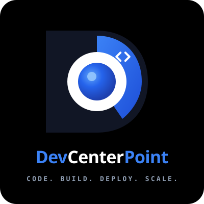

<div align="center">

# Shobdo · শব্দ
### The Bengali Word, Vision & Voice Engine
**বাংলা শব্দ, লিপি ও কণ্ঠস্বর বুদ্ধিমত্তা প্ল্যাটফর্ম**

[](https://devcenterpoint.com)
[](https://react.dev)
[](https://www.typescriptlang.org)
[](https://ai.google.dev)
[](https://tailwindcss.com)
[](https://firebase.google.com)

<p align="center">
  <a href="https://devcenterpoint.com">
    
  </a>
</p>

**An Initiative Engineered & Supported by [DevCenterPoint](https://devcenterpoint.com)**  
*CODE. BUILD. DEPLOY. SCALE.*

[Live Applet](https://ais-pre-vk7faxeuolrv2lo3madx7b-18937855618.asia-southeast1.run.app) • [DevCenterPoint Website](https://devcenterpoint.com) • [Report Issue](https://devcenterpoint.com/contact)

---

</div>

## 📖 Overview

In the Bengali language, the word **“শব্দ” (Shobdo)** holds a unique dual identity: it represents both the **written word** (*lexicon, orthography, script*) and the **acoustic sound** (*voice, phonemes, resonance*).

**Shobdo** is a production-grade multimodal Bengali intelligence workspace designed to handle the linguistic complexities of Bengali across text, vision, and speech:
1. **👁️ Vision OCR (নথি পাঠ)**: High-precision document OCR for historical manuscripts, legal deeds, government gazettes, and Rabindric handwriting with complex conjunct (যুক্তবর্ণ) preservation.
2. **✍️ Writing Studio (শুদ্ধ লেখনী)**: Grammar and orthography assistant enforcing Bangla Academy Promito standards, bidirectional Sadhu ⇄ Cholit conversion, 9 tonal adaptations, and animated typewriter streaming.
3. **🎙️ Voice to Text (কণ্ঠস্বর)**: Acoustic speech-to-text transcription trained on colloquial regional accents (Sylhet, Chittagong, Noakhali), speaker diarization with timestamps, and automated executive takeaways.
4. **🗃️ Cloud Archive Vault (হিস্ট্রি)**: Seamless persistent cross-session history powered by Google Firebase Firestore with Google Authentication.

---

## ⚡ Key Workspaces & Capabilities

### 1. Vision OCR (নথি পাঠ ও লিপি পুনর্গঠন)
* **Historical & Archival OCR**: Recognizes degraded print, microfilms, weathered deed stamps, and cursive manuscripts.
* **Complex Conjunct Preservation**: Retains intricate ligatures (e.g., `ক্ষ`, `জ্ঞ`, `ব্র`, `হ্ম`) without character dropping or split diacritics.
* **Tabular & Field Extraction**: Intelligently parses structured documents (NIDs, passports, land records, invoices) into JSON key-value pairs.
* **Dual-Language & Confidence Scoring**: Detects mixed Bengali-English text with localized confidence metrics.

### 2. Writing Studio & Grammar Engine (শুদ্ধ লেখনী)
* **Bangla Academy Standard Proofreader**: Real-time orthographic correction for spelling, vowel harmony, and punctuation.
* **Bidirectional Sadhu ⇄ Cholit**: Seamless transformation between formal classical prose (*সাধু ভাষা*) and modern standard colloquial (*চলিত ভাষা*).
* **Multi-Tone Stylistic Rephrasing**: Instant adaptation to Professional/Formal, Literary, Academic, Persuasive, Conversational, or Concise styles.
* **Animated Typewriter Output**: Grapheme-aware streaming text display using `Intl.Segmenter('bn')`, complete with active pulsing carets and instant skip controls.
* **Built-in Virtual Avro Keyboard**: In-browser phonetic typing and visual Bengali on-screen keyboard.
* **Long-Form Summarizer**: Extracts core themes, bulleted takeaways, and compression ratios from lengthy essays.

### 3. Voice to Text & Diarization (কণ্ঠস্বর ও উপভাষা)
* **Regional Dialect Alignment**: Accurately transcribes colloquial speech from Sylhet, Chittagong, Noakhali, and Standard Dhaka Bengali.
* **Speaker Diarization**: Separates multi-person conversations with estimated turn timestamps.
* **Audio Executive Briefings**: Generates synthesized summaries and actionable items from recorded voice notes.
* **In-Browser Audio Recording**: Record directly via microphone or upload `.mp3`, `.wav`, `.m4a`, `.ogg`, and `.webm` files.

### 4. Multi-Format Export Studio
* Export any output instantly as **PDF Document (.pdf)**, **Microsoft Word (.docx)**, **Markdown (.md)**, or **Plain Text (.txt)**.

---

## 🛠️ Architecture & Tech Stack

```
┌────────────────────────────────────────────────────────┐
│               Shobdo Client (React 19 + Vite 8)        │
│  - Tailwind CSS v4 + Motion + GSAP                     │
│  - Outfit & Anek Bangla Typography                     │
│  - Bilingual Context Engine (English / বাংলা)          │
└───────────────────────────┬────────────────────────────┘
                            │ /api/* (Reverse Proxy)
┌───────────────────────────▼────────────────────────────┐
│          Express Full-Stack Server (server.ts)         │
│  - @google/genai SDK (Gemini 2.5 Flash)                │
│  - Multimodal Vision, Audio & Linguistic Pipelines     │
└───────────────────────────┬────────────────────────────┘
                            │ Persistent Sync
┌───────────────────────────▼────────────────────────────┐
│      Firebase Cloud Firestore & Google Auth            │
│  - User history records & outcome archives             │
└────────────────────────────────────────────────────────┘
```

| Layer | Technologies |
|---|---|
| **Frontend** | React 19, TypeScript 5, Vite 8, Tailwind CSS v4, Motion, GSAP, Lucide Icons |
| **Backend** | Node.js, Express, tsx, CORS |
| **AI Models** | `@google/genai` TypeScript SDK (`gemini-2.5-flash`) |
| **Typography** | `Outfit`, `Anek Bangla`, `Hind Siliguri`, `Plus Jakarta Sans`, `JetBrains Mono` |
| **Database & Auth** | Google Firebase Firestore, Firebase Authentication |
| **Export Engines** | `docx` (Word Documents), Native Canvas / Print (PDF) |
| **Sponsor & Eng** | **[DevCenterPoint](https://devcenterpoint.com)** |

---

## 🚀 Getting Started

### Prerequisites
* **Node.js**: v18.0.0 or higher
* **npm**: v9.0.0 or higher
* **Gemini API Key**: Obtainable from [Google AI Studio](https://aistudio.google.com/)

### 1. Clone the Repository
```bash
git clone https://github.com/your-username/shobdo-bengali-ai.git
cd shobdo-bengali-ai
```

### 2. Install Dependencies
```bash
npm install
```

### 3. Configure Environment Variables
Create a `.env` file in the project root:
```env
GEMINI_API_KEY=your_gemini_api_key_here
PORT=3000
```

### 4. Run Development Server
```bash
npm run dev
```
The server will start at `http://localhost:3000` with hot-module reload enabled.

### 5. Production Build
```bash
npm run build
npm start
```

---

## 📡 API Proxy Endpoints

| Endpoint | Method | Purpose | Payload |
|---|---|---|---|
| `/api/ocr` | `POST` | Scanned document OCR & field extraction | `{ imageBase64, mimeType, mode }` |
| `/api/proofread` | `POST` | Grammar check, Sadhu-Cholit, tone rewrite | `{ text, mode, targetTone }` |
| `/api/transcribe` | `POST` | Audio voice-to-text with dialect parsing | `{ audioBase64, mimeType, dialect }` |
| `/api/summarize` | `POST` | Long-form Bengali text summarization | `{ text }` |
| `/api/tts` | `POST` | Bengali text-to-speech audio synthesis | `{ text }` |

---

## 🏢 Engineered & Powered by DevCenterPoint

[DevCenterPoint](https://devcenterpoint.com) is an enterprise technology firm specializing in:
* **Enterprise Cloud & AI Solutions**: Custom LLM integrations, retrieval-augmented generation (RAG), and high-throughput vision pipelines.
* **Full-Stack Application Development**: Mission-critical, resilient web, mobile, and distributed systems.
* **Scalable Infrastructure Architecture**: Cloud-native deployments, Kubernetes orchestration, and automated CI/CD pipelines.

*Motto: **CODE. BUILD. DEPLOY. SCALE.***  
*Website:* [https://devcenterpoint.com](https://devcenterpoint.com)

---

## 📜 License & Compliance

Distributed under the **MIT License**. Compliant with **Bangla Academy Promito Banan (বাংলা একাডেমি প্রমিত বানান)** standards and Google Cloud enterprise security guidelines.

---

<div align="center">
  <sub>Built with ❤️ for the Bengali Language by <a href="https://devcenterpoint.com"><b>DevCenterPoint</b></a>.</sub>
</div>
